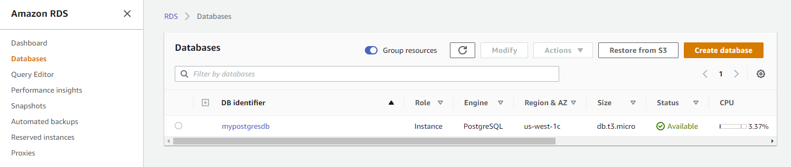
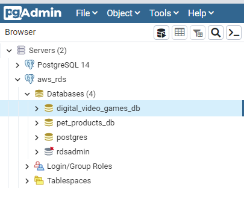
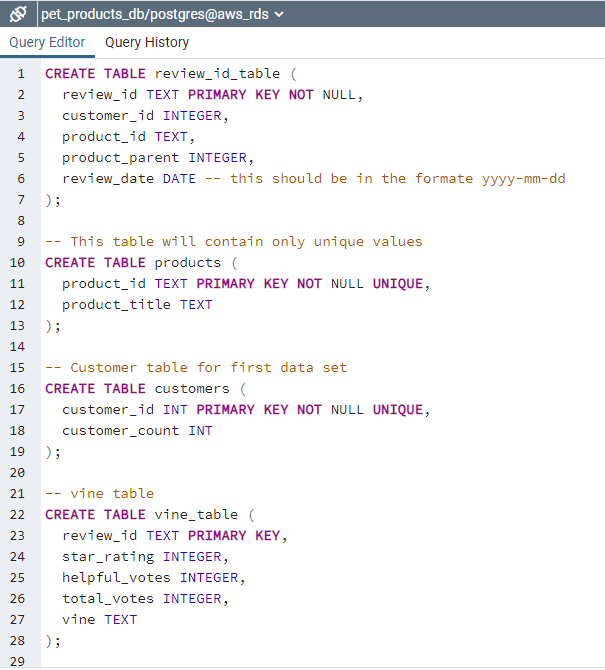
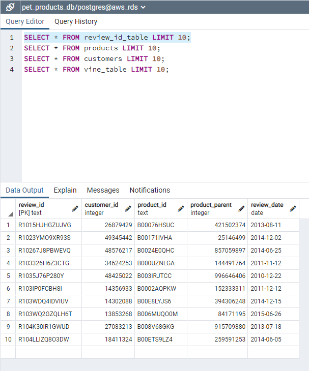
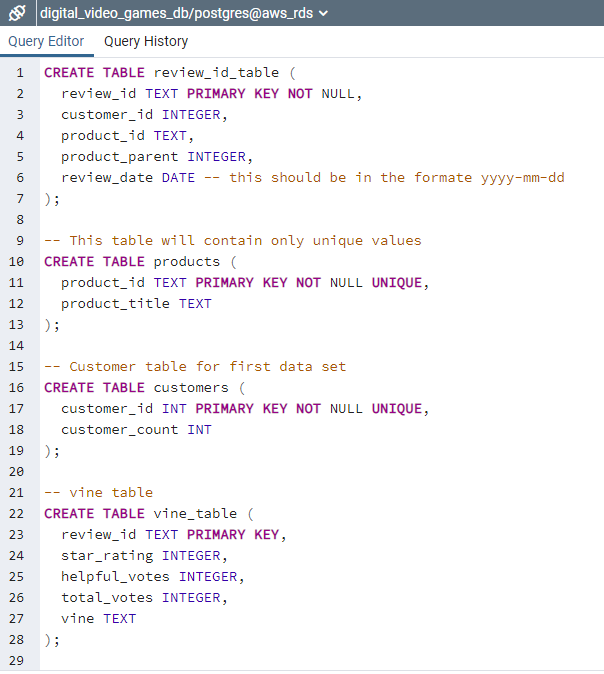
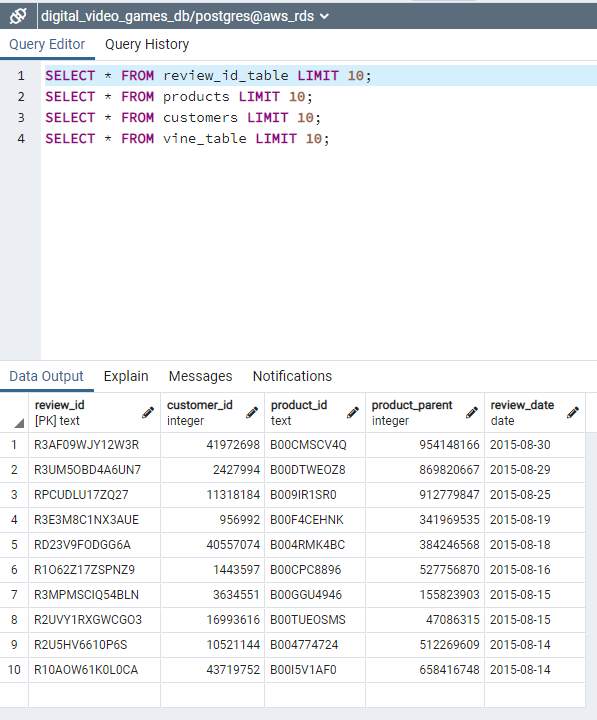

# "Alexa, can You Handle Big Data?"
#### Created by: Estela Perez

## Objective 
The purpose of this assignment was to use cloud ETL skills on big data from two of Amazon's available public datasets on product reviews. The goal is to perfrom the ETL process completely in the cloud and upload a DataFrame to an RDS instance.

This project required the use of Amazon Web Service (AWS), Relational Database Service (RDS), pgAdmin, google Colab, PySpark, and Google Colab

## AWS-RDS
Started by creating an AWS-RDS to connect to pgAdmin

## pgAdmin
Then registered our AWS-RDS server in pgAdmin - displaying our databases for both datasets

## ETL Process: Pet Products Dataset
### Extract
* Extracted dataset:  https://s3.amazonaws.com/amazon-reviews-pds/tsv/amazon_reviews_us_Pet_Products_v1_00.tsv.gz
* Extracted number or records: 2,643,619 

### Transform

### Load
One step before the loading - was to create the schema for our loading tables in pgAdmin

After the schema was created - we were able to move to the loading process

Checking that load was successful in pgAdmin (one example)

## ETL Process: Digital Video Games Dataset
### Extract
* Extracted dataset:  https://s3.amazonaws.com/amazon-reviews-pds/tsv/amazon_reviews_us_Digital_Video_Games_v1_00.tsv.gz
* Extracted number or records: 145,431

### Transform

### Load
One step before the loading - was to create the schema for our loading tables in pgAdmin

After the schema was created - we were able to move to the loading process

Checking that load was successful in pgAdmin (one example)

